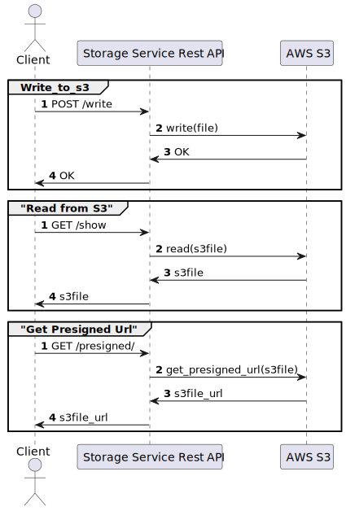

# storage-service
Rest API that is used to store and retrieve files from s3

# create .env
1. Create .env file
2. Add `S3_BUCKET_NAME = '[your bucket name]'`

# export AWS environment varibles 
1. set up local environment variables, either by running `export` command or adding permanently to bash/zsh profile (preferred)
    - `export AWS_SECRET_ACCESS_KEY=<aws-secret-key>`
    - `export AWS_ACCESS_KEY_ID=<aws-id>`

## Initial Run
1. `python3 -m venv env`
2. `source env/bin/activate`
3. `python -m pip install --upgrade pip`
4. `pip install -r requirements.txt`
5. `python -m uvicorn src.main:app --reload`

## Create Sequence Diagram

### Install plantuml on command line
    
    brew install plantuml

### Run following plantuml command
    
    plantuml -tsvg README.md

## Sequence Diagram: 

    @startuml StorageServiceDiagram

    actor Client

    group Write_to_s3
    autonumber

    Client -> "Storage Service Rest API": POST /write
    "Storage Service Rest API" -> "AWS S3": write(file)
    "AWS S3" -> "Storage Service Rest API": OK
    "Storage Service Rest API" -> Client: OK
    end

    autonumber

    group "Read from S3"
    Client -> "Storage Service Rest API": GET /show
    "Storage Service Rest API" ->  "AWS S3": read(s3file)
    "AWS S3" -> "Storage Service Rest API": s3file
    "Storage Service Rest API" -> Client: s3file
    end

    autonumber
    group "Get Presigned Url"
    Client -> "Storage Service Rest API": GET /presigned/
    "Storage Service Rest API" ->  "AWS S3": get_presigned_url(s3file)
    "AWS S3" -> "Storage Service Rest API": s3file_url
    "Storage Service Rest API" -> Client: s3file_url
    end

    @enduml

